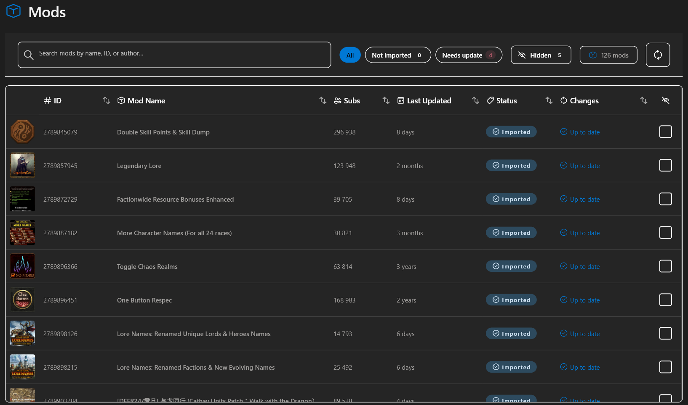
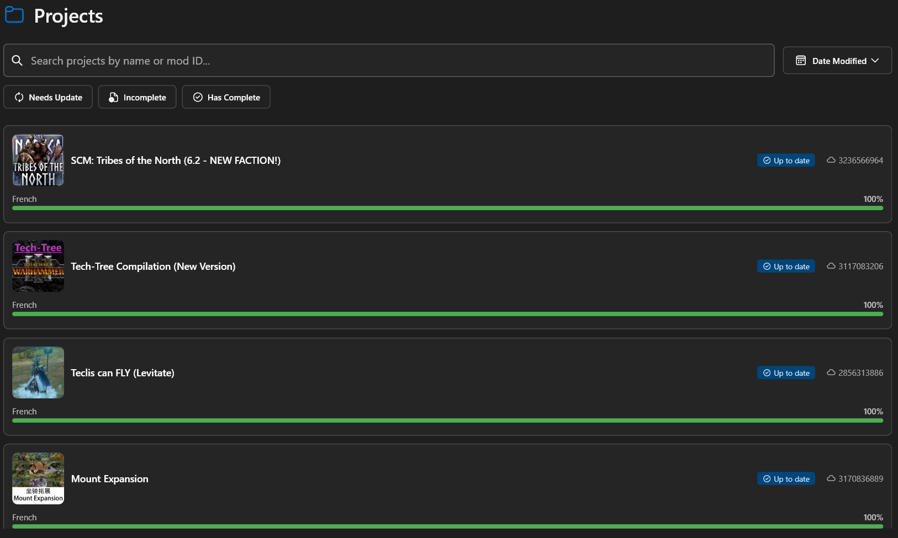
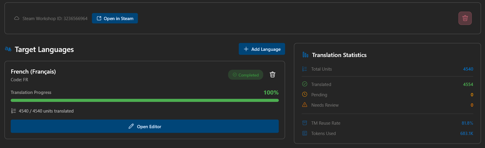
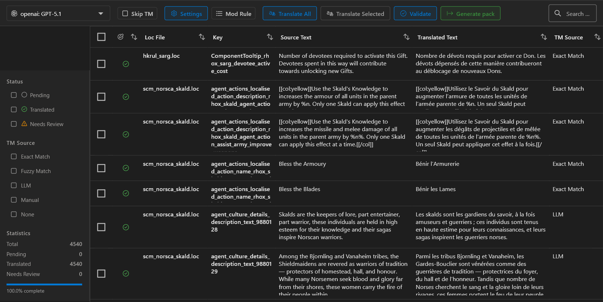
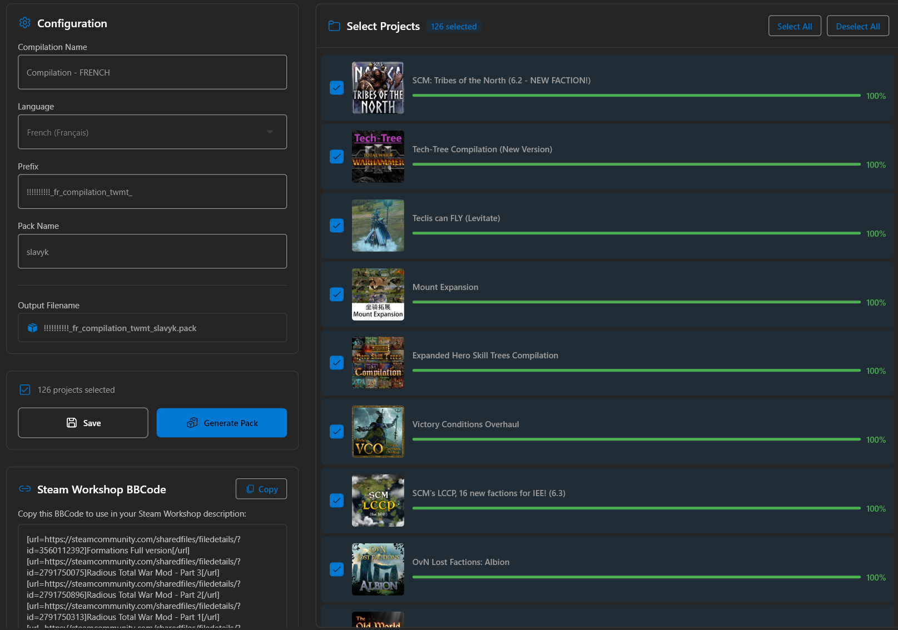
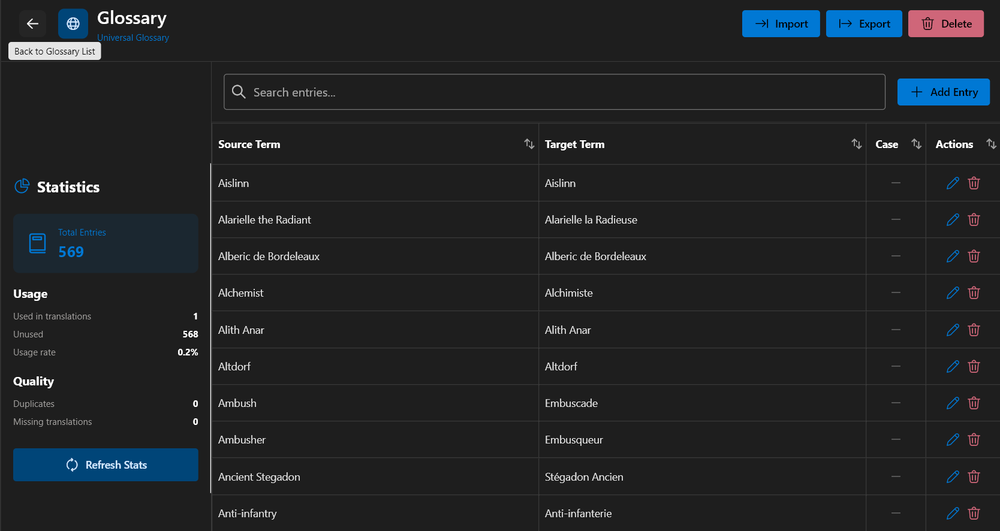
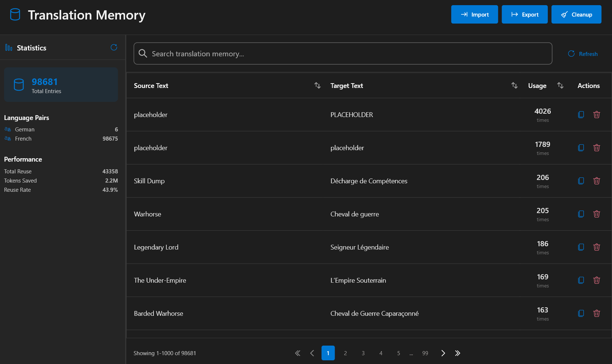

# TWMT - Total War Mods Translator

---

## About

TWMT (Total War Mods Translator) is a Windows application designed to translate Total War mods from Steam Workshop. It combines AI translation with workflow tools to ease creation and maintenance of translations efficiently.

### Key Features

- **AI Translation** - Translate thousands of entries using Claude, GPT, or DeepL
- **Glossaries** - Maintain consistent terminology across all translations
- **Translation Memory** - Reuse previous translations to save time and costs
- **Fast Search & Filtering** - Quickly find and edit translations
- **Progress Tracking** - Monitor translation completion per project and language
- **Direct Pack Export** - Generate game-ready .pack files
- **Multi-Project Management** - Handle multiple translation projects simultaneously

### Supported Games

| Game | Code |
|------|------|
| Total War: Warhammer III | wh3 |
| Total War: Warhammer II | wh2 |
| Total War: Warhammer | wh |
| Total War: Rome II | rome2 |
| Total War: Attila | attila |
| Total War: Troy | troy |
| Total War: Three Kingdoms | 3k |
| Total War: Pharaoh | pharaoh |

---

## Requirements

- **Windows 10/11**
- **RPFM CLI** - [Download from GitHub](https://github.com/Frodo45127/rpfm) (required for pack file operations)
- **API Key** - From one of the supported providers:
  - [Anthropic (Claude)](https://console.anthropic.com)
  - [OpenAI](https://platform.openai.com)
  - [DeepL](https://www.deepl.com/pro-api)

---

## Quick Start

1. **Download** the latest release from [GitHub Releases](https://github.com/Slavyk82/Total-War-Mods-Translator/releases)
2. **Install** RPFM CLI and configure its path in Settings > Folders
3. **Configure** your API key in Settings > LLM Providers
4. **Detect** your game installations in Settings > Folders > Auto-Detect
5. **Start** translating from the Mods screen

---

## Documentation

For complete documentation, see the **[User Guide](docs/user_guide.md)** which covers:

- [Getting Started](docs/user_guide.md#getting-started)
- [Game Translation](docs/user_guide.md#game-translation)
- [Mods Screen](docs/user_guide.md#mods-screen)
- [Projects Screen](docs/user_guide.md#projects-screen)
- [Translation Editor](docs/user_guide.md#translation-editor)
- [Pack Compilation](docs/user_guide.md#pack-compilation)
- [Glossary](docs/user_guide.md#glossary)
- [Translation Memory](docs/user_guide.md#translation-memory)
- [Settings](docs/user_guide.md#settings)

---

## Screenshots

Click to view screenshots

### Mods Screen

### Projects Screen

### Project Overview

### Translation Editor

### Pack Compilation

### Glossary

### Translation Memory

---

## Support

- **Issues**: [GitHub Issues](https://github.com/Slavyk82/Total-War-Mods-Translator/issues)
- **Releases**: [GitHub Releases](https://github.com/Slavyk82/Total-War-Mods-Translator/releases)

---

## License

This project is open source. See the LICENSE file for details.
